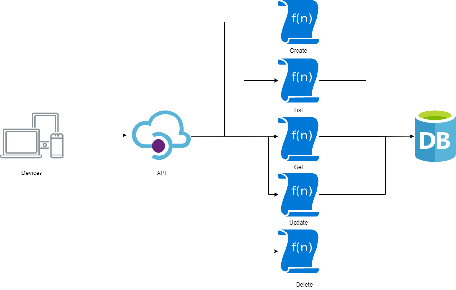

# Integration Tests on Serverless Platforms

— A benchmark of different tools for integration testing in serverless.

* [aws_dynamodb](https://github.com/bajo1207/Integration-Tests-on-Serverless-Platforms/tree/main/aws_dynamodb), [azure_cosmosdb](https://github.com/bajo1207/Integration-Tests-on-Serverless-Platforms/tree/main/azure_cosmosdb) and [google_firestore](https://github.com/bajo1207/Integration-Tests-on-Serverless-Platforms/tree/main/google_firestore) contains the respective todo applications and serverless frameworks for wich the bechmark was created.
The todo application is created as equally as possible for all the providers, as shown in the picture below.

* The applications are tested using Jenkins continuous integration server. The Jenkins server can be found in [jenkins_container](https://github.com/bajo1207/Integration-Tests-on-Serverless-Platforms/tree/main/jenkins_container).

* The python container used to execute the tests within the Jenkins container can be found in [python_container](https://github.com/bajo1207/Integration-Tests-on-Serverless-Platforms/tree/main/python_container).

* The analysis of the benchmark can be found in [data_analysis](https://github.com/bajo1207/Integration-Tests-on-Serverless-Platforms/tree/main/data_analysis).

* The scripts to run the benchmark and get the data from the benchmark can be found in [benchmark_scripts](https://github.com/bajo1207/Integration-Tests-on-Serverless-Platforms/tree/main/benchmark_scripts).

* A simple frontend to display the application can be found in [frontend](https://github.com/bajo1207/Integration-Tests-on-Serverless-Platforms/tree/main/frontend).
The frontend is based on [this tutorial.](https://freshman.tech/todo-list/)



## Step by step guide to get everything working
1. First install the following tools: [AWS SAM CLI](https://docs.aws.amazon.com/serverless-application-model/latest/developerguide/serverless-sam-cli-install.html), [Azure Functions Core Tools](https://github.com/Azure/azure-functions-core-tools) and [Functions Framework](https://cloud.google.com/functions/docs/functions-framework?hl=de)
1. Configure the three applications:
   ### AWS
   1. First run the AWS build command: 
   ```{bash}
   sam build --guided
   ``` 
   Follow the instructions in the command line. All necessary resources will be created.

   2. Get credentials to access the created DynamoDB table in AWS. And put them in the docker-compose file in [jenkins_container](https://github.com/bajo1207/Integration-Tests-on-Serverless-Platforms/tree/main/jenkins_container)

   2. (Optional) If the emulated version of DynamoDB should be used, the following needs to be added to the Jenkins file in the build stage:
   ```{bash}
    docker run --rm -d -p 8000:8000 --network dynamoNet --name dynamo amazon/dynamodb-local
    aws dynamodb create-table --cli-input-json file://create_todo_table.json --endpoint-url http://dynamo:8000
   ```
   ### Azure
   1. Run the func init comand, and follow the instrunctions:
   ```{bash}
   func init
   ```
   2. Create a [CosmosDB](https://azure.microsoft.com/en-us/services/cosmos-db/) database, with partition `key = id`
   3. Go to the created Azure Functions Application and add the cosmos key and URL to the applications settings parameters
   4. Download the Azure Functions plugin for VS code and download the local.settings.json
   5. Replace the local.settings.json in the [python_container](https://github.com/bajo1207/Integration-Tests-on-Serverless-Platforms/tree/main/python_container) with the local.settings.json just downloaded

   ### Google
   1. Create a Cloud Firestore database and download the credentials
   2. Put the credentials in the [python_container](https://github.com/bajo1207/Integration-Tests-on-Serverless-Platforms/tree/main/python_container) and specify the credentials name in the Docker file and in the Jenkins file
1. Start the Jenkins container with the following command:
   ```{bash}
   docker-compose up
   ```
1. Follow the instructions to set up the Jenkins server – Jenkins can be found on `localhost:8080`
1. Install the `Docker Pipeline plugin` and `Docker plugin` in Jenkins
1. Create a pipeline in Jenkins for all the todo applications and point Jenkins to the Jennkinsfile in each application directory
1. Then build the [python_container](https://github.com/bajo1207/Integration-Tests-on-Serverless-Platforms/tree/main/python_container) using the docker build command:
   ```{bash}
   docker build --tag pythoncontainer:latest .
   ```
1. Create a docker network called `dynamoNet`
   ```{bash}
   docker network create
   ```
1. Use the scripts in [benchmark_scripts](https://github.com/bajo1207/Integration-Tests-on-Serverless-Platforms/tree/main/benchmark_scripts) to run the benchmark and get the various data
